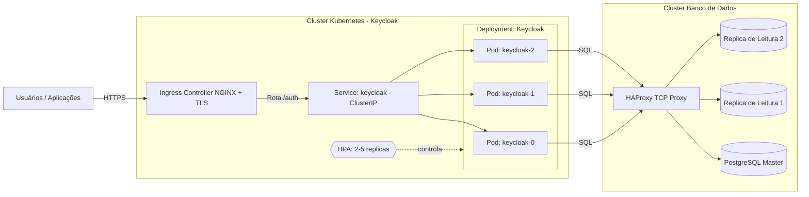

# Arquitetura de Alta Disponibilidade — Keycloak 26+

## 📘 Visão Geral

A partir da versão **26**, o **Keycloak** passou a manter as **sessões de usuário no banco de dados**, eliminando a dependência de cache distribuído (como Infinispan) para persistência de sessão.  
Isso simplifica a arquitetura de alta disponibilidade (HA) e torna possível escalar horizontalmente os pods do Keycloak sem perder sessões.

Essa mudança é fundamental para a **infraestrutura da Docway**, pois permite alta disponibilidade e resiliência com menor complexidade de configuração.

---

## ⚙️ Topologia Recomendada

O **Keycloak** deve ser implantado em um **cluster Kubernetes** com:

- **Mínimo:** 2 réplicas (para garantir disponibilidade)
- **Máximo:** 5 réplicas (via HPA - Horizontal Pod Autoscaler)
- **Banco de dados externo** (em outro cluster ou serviço dedicado)
- **Monitoramento contínuo** de desempenho e consumo de recursos

### Benefício da nova arquitetura

Como as sessões estão no banco de dados, a perda de um pod não invalida as sessões ativas.  
Isso significa que o HPA pode escalar os pods (para cima ou para baixo) sem desconectar usuários.

---

## 📈 Escalabilidade e Disponibilidade

| Componente | Tipo de Escala | Impacto Principal | Observações |
|-------------|----------------|------------------|--------------|
| **Keycloak (Pods)** | Horizontal | Disponibilidade | Múltiplas réplicas garantem redundância. Sessões persistem no banco. |
| **Banco de Dados** | Vertical / Horizontal | Performance | Aumentar CPU, memória e IOPS melhora tempo de resposta. |

> ⚠️ **Importante:** o aumento no número de réplicas do Keycloak **não melhora a performance** da autenticação em si, mas garante continuidade do serviço em caso de falhas.

---

## 🔍 Monitoramento e Observabilidade

Deve ser implementado monitoramento contínuo de:
- Uso de CPU e memória dos pods
- Métricas de resposta e latência (Keycloak)
- Conexões e tempo de resposta do banco de dados
- Triggers de autoescalonamento (HPA)
- Logs centralizados (Prometheus + Grafana ou similar)

Esses dados devem orientar ajustes periódicos nos limites de recursos e regras de escalabilidade.

---

## ⚡ Melhoria de Performance

Para melhorar o desempenho, as seguintes ações são recomendadas:

1. **Aumentar recursos do cluster:**
   - Mais CPU e memória por nó
   - Armazenamento SSD com alta taxa de IOPS

2. **Reduzir latência geográfica:**
   - Manter **Keycloak, banco de dados e aplicações na mesma região geográfica**
   - Preferência por **datacenters no Brasil** para usuários locais

3. **Escalar o banco de dados:**
   - **Verticalmente:** mais CPU, memória e IOPS
   - **Horizontalmente:** adicionar réplicas de leitura

---

## 🗄️ Estrutura do Banco de Dados

Existem duas abordagens possíveis para o banco de dados PostgreSQL usado pelo Keycloak:

### ☁️ Cloud (Google Cloud SQL)

- Instância gerenciada com réplicas de leitura opcionais
- Custo de cada réplica equivale ao custo do master
- HA dobra o custo (réplica síncrona em outra zona)
- Custo adicional com **saída de rede** entre zonas
- Simplifica o gerenciamento (backup, patch, failover automático)

### 🏢 On-Premises

#### Requisitos:

- **Proxy L4 (TCP)** — recomendado **HAProxy**
- **1 banco master** (escrita)
- **1 ou mais bancos de leitura**

#### Fluxo de Escrita e Leitura:

- Todas as **escritas** vão para o **master**
- O **master replica** os dados para os bancos de leitura
- Se o **master cair**, as leituras continuam funcionando, mas as escritas falham até a recuperação
- Se cair um banco de leitura, não há impacto na disponibilidade geral

#### Benefício:

O Keycloak aponta para o **host do HAProxy**, que distribui as conexões de forma transparente, garantindo:
- Alta disponibilidade
- Failover simplificado
- Compatibilidade com múltiplas réplicas de Keycloak e de banco

---

## 🧭 Diagrama da Arquitetura



---

## 🧭 Aplicação

> Os scripts abaixo foram aplicados no WSL2 usando a distro Ubuntu.

### Docker Compose:

```yml
services:

  pg1:
    image: postgres:16
    container_name: pg1
    environment:
      POSTGRES_USER: postgres
      POSTGRES_PASSWORD: senha123
      POSTGRES_DB: appdb
    volumes:
      - pg1_data:/var/lib/postgresql/data
      - ./init-primary.sh:/docker-entrypoint-initdb.d/init-primary.sh:ro

  pg2:
    image: postgres:16
    container_name: pg2
    environment:
      POSTGRES_USER: postgres
      POSTGRES_PASSWORD: senha123
      POSTGRES_DB: appdb
    restart: always
    volumes:
      - pg2_data:/var/lib/postgresql/data
      - ./init-replica.sh:/docker-entrypoint-initdb.d/init-replica.sh:ro

  pg3:
    image: postgres:16
    container_name: pg3
    environment:
      POSTGRES_USER: postgres
      POSTGRES_PASSWORD: senha123
      POSTGRES_DB: appdb
    restart: always
    volumes:
      - pg3_data:/var/lib/postgresql/data
      - ./init-replica.sh:/docker-entrypoint-initdb.d/init-replica.sh:ro

  haproxy:
    image: haproxy:2.9
    container_name: haproxy
    ports:
      - "6432:6432"
      - "8404:8404"
    volumes:
      - ./haproxy.cfg:/usr/local/etc/haproxy/haproxy.cfg:ro

volumes:
  pg1_data:
  pg2_data:
  pg3_data:
```

### haproxy.cfg

```cfg
global
    maxconn 200

defaults
    log global
    mode tcp
    timeout connect 10s
    timeout client 1m
    timeout server 1m

frontend postgresql
    bind *:6432
    default_backend pg_cluster

backend pg_cluster
    mode tcp
    balance roundrobin
    option tcp-check
    server pg1 pg1:5432 check
    server pg2 pg2:5432 check backup
    server pg3 pg3:5432 check backup

listen stats
    bind *:8404
    mode http
    stats enable
    stats uri /
    stats refresh 5s
```

### init-primary.sh

```bash
#!/bin/bash
set -e
echo "Configuring primary (pg1)..."

cat >> /var/lib/postgresql/data/postgresql.conf <<EOF
wal_level = replica
max_wal_senders = 10
wal_keep_size = 64
listen_addresses = '*'
EOF

cat >> /var/lib/postgresql/data/pg_hba.conf <<EOF
host replication replicator all md5
host all all all md5
EOF

psql -U postgres -c "CREATE ROLE replicator WITH REPLICATION LOGIN PASSWORD 'replica123';"
echo "Primary setup complete."
```

### init-replica.sh

```bash
#!/bin/bash
set -e
echo "Configuring replica..."
sleep 10
rm -rf /var/lib/postgresql/data/*

PGPASSWORD=replica123 pg_basebackup -h pg1 -D /var/lib/postgresql/data -U replicator -Fp -Xs -P -R

echo "Replica setup complete."

```

### Levantando o ambiente:

```sh
docker compose up
```

### Testando o proxy:

```sh

# Atenção: Execute linha a linha. Não execute todo o script abaixo de uma só vez.

# 1) Instalação do client do postgres
sudo apt install postgresql-client-common postgresql-client
psql --version

# 2) Teste de proxy + replicação
# Conectando no server (senha -> senha123)
psql -h localhost -p 6432 -U postgres -d appdb
# Note aque estamos nos conectando no host do HAproxy.
# Se você se conectou, significa que o proxy está funcionando.

# Criação de tabela + inserção de dado pra teste
CREATE TABLE teste (id serial PRIMARY KEY, nome text);
INSERT INTO teste (nome) VALUES ('Replica funcionando!');
# Toda operação de escrita é realizada no nó master, ou seja, pg1

# 3) Testando a replicação
docker exec -it pg2 psql -U postgres -d appdb -c "SELECT * FROM teste;" # teste no primeiro nó de replicação, o pg2
docker exec -it pg3 psql -U postgres -d appdb -c "SELECT * FROM teste;" # teste no segundo nó de replicação, o pg3

# Se você conseguiu consultar a tabela "teste" com uma linha com o valor "Replica funcionando!" em cada um dos nós de replicação, então a replicação está funcionando.
```

---

✅ Conclusão

Com o Keycloak 26+, a alta disponibilidade torna-se mais simples e robusta, já que:

- Sessões estão centralizadas no banco de dados;
- Réplicas de aplicação podem escalar livremente;
- O uso de proxy e réplicas de banco garante resiliência e continuidade.

A arquitetura proposta assegura alta disponibilidade, resiliência a falhas, e possibilidade de evolução gradual — tanto em infraestrutura quanto em escala de usuários.

---
Responsável técnico: Gilberto Ferreira

Projeto: Docway — Infraestrutura de Autenticação

Versão: 1.0

Data: 2025-10-06