# Arquitetura de Alta Disponibilidade — Keycloak 26+

## 📘 Visão Geral

A partir da versão **26**, o **Keycloak** passou a manter as **sessões de usuário no banco de dados**, eliminando a dependência de cache distribuído (como Infinispan) para persistência de sessão.  
Isso simplifica a arquitetura de alta disponibilidade (HA) e torna possível escalar horizontalmente os pods do Keycloak sem perder sessões.

Essa mudança é fundamental para a **infraestrutura da Docway**, pois permite alta disponibilidade e resiliência com menor complexidade de configuração.

---

## ⚙️ Topologia Recomendada

O **Keycloak** deve ser implantado em um **cluster Kubernetes** com:

- **Mínimo:** 2 réplicas (para garantir disponibilidade)
- **Máximo:** 5 réplicas (via HPA - Horizontal Pod Autoscaler)
- **Banco de dados externo** (em outro cluster ou serviço dedicado)
- **Monitoramento contínuo** de desempenho e consumo de recursos

### Benefício da nova arquitetura

Como as sessões estão no banco de dados, a perda de um pod não invalida as sessões ativas.  
Isso significa que o HPA pode escalar os pods (para cima ou para baixo) sem desconectar usuários.

---

## 📈 Escalabilidade e Disponibilidade

| Componente | Tipo de Escala | Impacto Principal | Observações |
|-------------|----------------|------------------|--------------|
| **Keycloak (Pods)** | Horizontal | Disponibilidade | Múltiplas réplicas garantem redundância. Sessões persistem no banco. |
| **Banco de Dados** | Vertical / Horizontal | Performance | Aumentar CPU, memória e IOPS melhora tempo de resposta. |

> ⚠️ **Importante:** o aumento no número de réplicas do Keycloak **não melhora a performance** da autenticação em si, mas garante continuidade do serviço em caso de falhas.

---

## 🔍 Monitoramento e Observabilidade

Deve ser implementado monitoramento contínuo de:
- Uso de CPU e memória dos pods
- Métricas de resposta e latência (Keycloak)
- Conexões e tempo de resposta do banco de dados
- Triggers de autoescalonamento (HPA)
- Logs centralizados (Prometheus + Grafana ou similar)

Esses dados devem orientar ajustes periódicos nos limites de recursos e regras de escalabilidade.

---

## ⚡ Melhoria de Performance

Para melhorar o desempenho, as seguintes ações são recomendadas:

1. **Aumentar recursos do cluster:**
   - Mais CPU e memória por nó
   - Armazenamento SSD com alta taxa de IOPS

2. **Reduzir latência geográfica:**
   - Manter **Keycloak, banco de dados e aplicações na mesma região geográfica**
   - Preferência por **datacenters no Brasil** para usuários locais

3. **Escalar o banco de dados:**
   - **Verticalmente:** mais CPU, memória e IOPS
   - **Horizontalmente:** adicionar réplicas de leitura

---

## 🗄️ Estrutura do Banco de Dados

Existem duas abordagens possíveis para o banco de dados PostgreSQL usado pelo Keycloak:

### ☁️ Cloud (Google Cloud SQL)

- Instância gerenciada com réplicas de leitura opcionais
- Custo de cada réplica equivale ao custo do master
- HA dobra o custo (réplica síncrona em outra zona)
- Custo adicional com **saída de rede** entre zonas
- Simplifica o gerenciamento (backup, patch, failover automático)

### 🏢 On-Premises

#### Requisitos:

- **Proxy L4 (TCP)** — recomendado **HAProxy**
- **1 banco master** (escrita)
- **1 ou mais bancos de leitura**

#### Fluxo de Escrita e Leitura:

- Todas as **escritas** vão para o **master**
- O **master replica** os dados para os bancos de leitura
- Se o **master cair**, as leituras continuam funcionando, mas as escritas falham até a recuperação
- Se cair um banco de leitura, não há impacto na disponibilidade geral

#### Benefício:

O Keycloak aponta para o **host do HAProxy**, que distribui as conexões de forma transparente, garantindo:
- Alta disponibilidade
- Failover simplificado
- Compatibilidade com múltiplas réplicas de Keycloak e de banco

---

## 🧭 Diagrama da Arquitetura

```mermaid
flowchart LR
  subgraph K8S[Cluster Kubernetes - Keycloak]
    subgraph Deploy[Deployment: Keycloak]
      K1[Pod: keycloak-0]
      K2[Pod: keycloak-1]
      K3[Pod: keycloak-2]
    end

    SVC[Service: keycloak - ClusterIP]
    HPA{{HPA: 2-5 replicas}}
    ING[Ingress Controller NGINX + TLS]
  end

  subgraph DB[Cluster Banco de Dados]
    HA[HAProxy TCP Proxy]
    M[(PostgreSQL Master)]
    R1[(Replica de Leitura 1)]
    R2[(Replica de Leitura 2)]
  end

  Users[Usuários / Aplicações] -->|HTTPS| ING
  ING -->|Rota /auth| SVC
  SVC --> K1
  SVC --> K2
  SVC --> K3
  HPA -.controla.-> Deploy
  K1 -->|SQL| HA
  K2 -->|SQL| HA
  K3 -->|SQL| HA
  HA --> M
  HA --> R1
  HA --> R2
```

---

✅ Conclusão

Com o Keycloak 26+, a alta disponibilidade torna-se mais simples e robusta, já que:

- Sessões estão centralizadas no banco de dados;
- Réplicas de aplicação podem escalar livremente;
- O uso de proxy e réplicas de banco garante resiliência e continuidade.

A arquitetura proposta assegura alta disponibilidade, resiliência a falhas, e possibilidade de evolução gradual — tanto em infraestrutura quanto em escala de usuários.

---
Responsável técnico: Gilberto Ferreira

Projeto: Docway — Infraestrutura de Autenticação

Versão: 1.0

Data: 2025-10-06